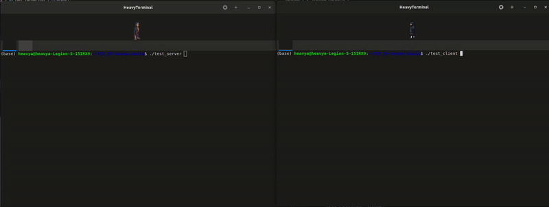

# TCP/IP Socket 
This repo is an implementation of an easy-to-use socket for communicating data through TCP/IP.

## DEMO

<p align="center">
  
</p>
This shows the transfer of data between socket and client using the lib. 

## ✨ Features

- Custom data type supported
- Easy to integrate to code base
- Can be configured to server/client mode 
- Template based code
- Same class can be configured to be used as server/client

---

## 🔧 Dependencies

- **C++14 or later**

## Building
```bash 
mkdir build
cd build
cmake ..
make -j
```

## Test
Read the test scripts comments to understand the usage
```bash
./test_server
./test_client
```


